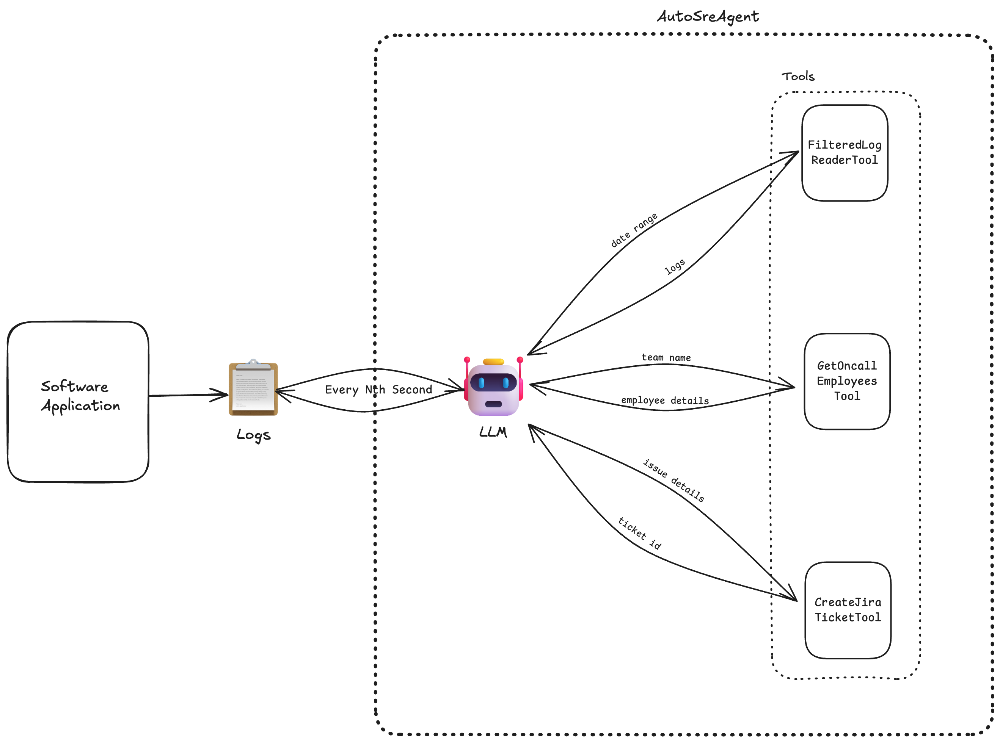

# Automated SRE Agent

An automated Site Reliability Engineering (SRE) tool that monitors application logs, detects errors, and automates incident management by creating Jira tickets.

## 🔧 Features

- Continuous log monitoring for error detection
- Intelligent detection of on-call employees
- Automatic Jira ticket creation and assignment to appropriate personnel

You can see an end-to-end execution demo in [`experimental/exp.ipynb`](experimental/exp.ipynb).

The script [`main.py`](main.py) runs continuously, periodically scanning the log file for new errors.

---

## ⚙️ Configuration

To get started:

1. Copy `.env.example` to `.env` and fill in the necessary configuration values.

Additional configuration options:

- `MONITORING_INTERVAL` – Time interval (in seconds) between log checks (default: `60`)
- `LOG_FILE_PATH` – Path to the log file to monitor

---

## 🧪 Testing

If you don’t have a log file to test with:

- Use the helper script [`utils/random_log_generator.py`](utils/random_log_generator.py) to generate synthetic logs.
- Or, simply try with the provided sample log file: [`output/logs.log`](output/logs.log)

---

## 📌 Footnotes

This project was developed as part of the course **CS 595 - TCPS: MLOps for Generative AI**.

Special thanks to [Professor Santosh Nukavarapu](https://www.odu.edu/directory/santosh-nukavarapu) for such interesting project!
